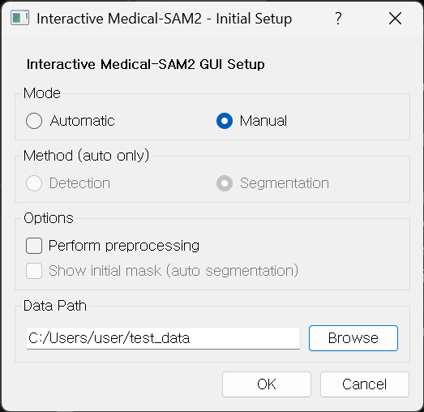
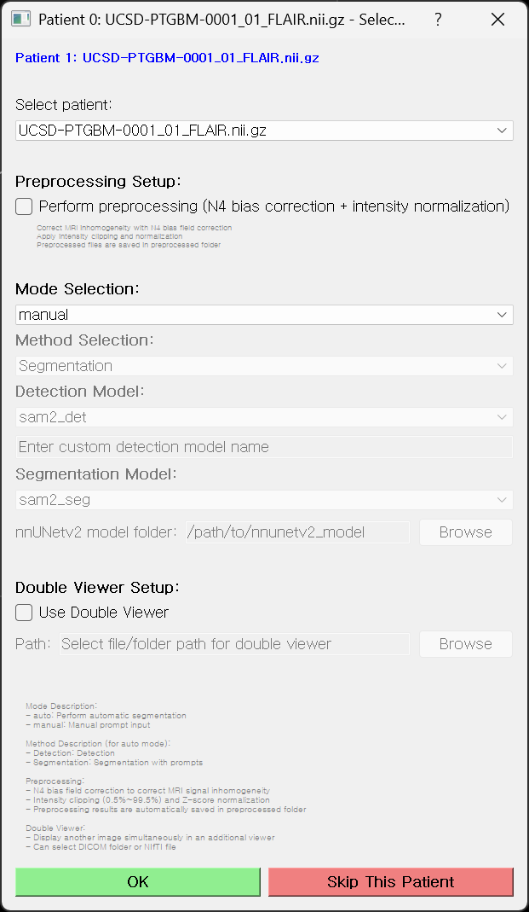
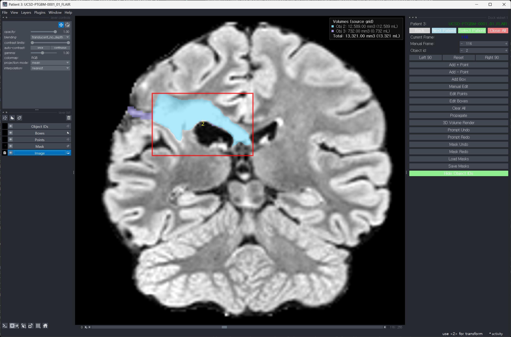
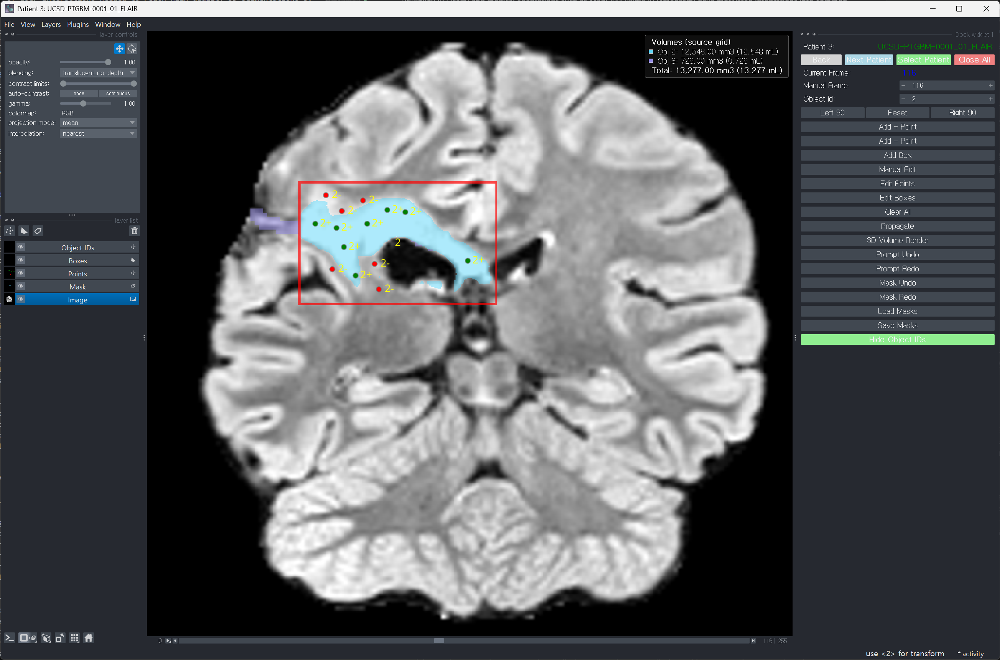
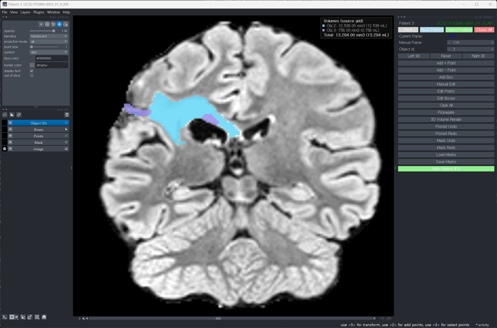
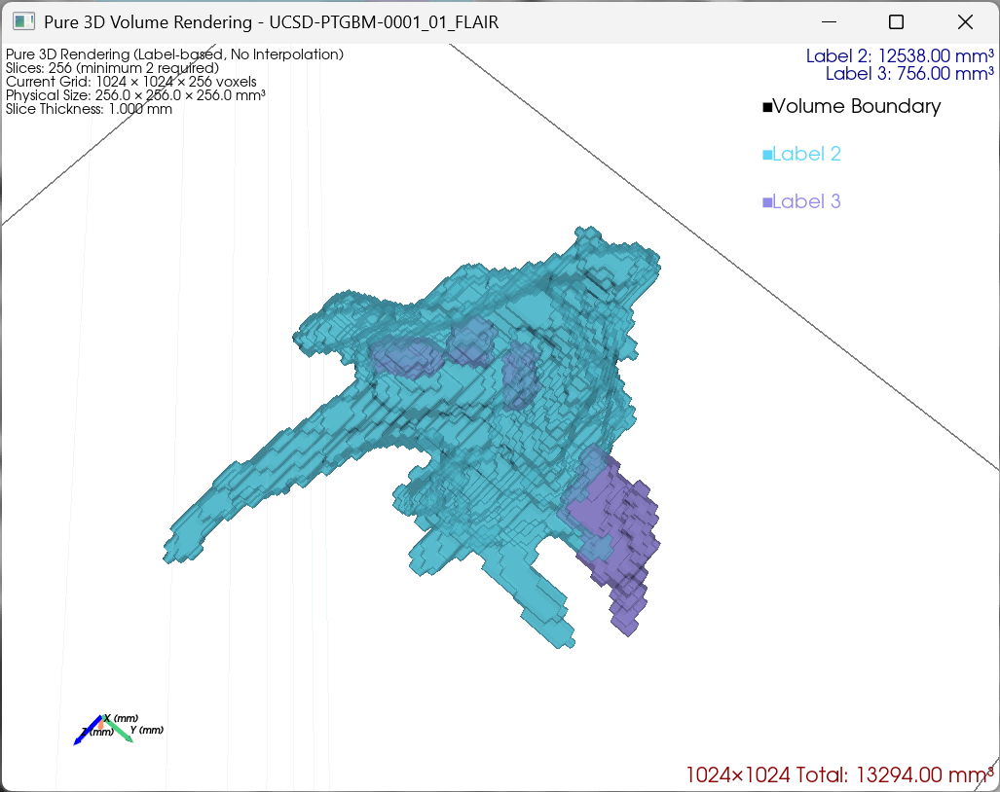

# Interactive Medical-SAM2 GUI

[](https://github.com/SKKU-IBE/Medical-SAM2GUI/actions/workflows/tests.yml)
[](LICENSE)
[](CHANGELOG.md)

Interactive Medical-SAM2 GUI is a local-first Napari application for semi-automatic annotation of 3D medical images. It discovers DICOM series and NIfTI volumes in one cohort folder, supports box and point prompts with Medical-SAM2 propagation, allows final manual correction, reloads existing label maps, reports source-grid volumes, and exports geometry-preserving masks.

The software is intended for research annotation workflows. It is not a medical device and does not provide clinical decision support.


The demonstration uses the public TCIA `UCSD-PTGBM-0001_01` case. The corresponding FLAIR volume and tumor label map are included in [`test_data/`](test_data/README.md) under CC BY 4.0. Asset provenance and attribution are recorded in [MEDIA_PROVENANCE.md](MEDIA_PROVENANCE.md).

## Workflow

1. Select a root folder containing DICOM series, NIfTI volumes, or both.
2. Choose Manual or Automatic mode and optional preprocessing.
3. Open a study from the automatically generated patient list.
4. Add box prompts and optional positive or negative point prompts.
5. Propagate the mask over the selected slice range.
6. Correct the result with paint, erase, or fill tools.
7. Optionally load a saved or external label map and continue editing.
8. Review live per-object and total volumes, then save source-grid outputs.


## Features

- **Automatic mixed-format discovery:** recursively builds one study queue from DICOM series and NIfTI volumes without a format-specific loading step.
- **Label-map exclusion:** skips `preprocessed` and `*_masks` directories and inspects NIfTI metadata and values to keep detected label maps out of the patient list.
- **Cohort navigation:** processes studies sequentially with previous, next, skip, and direct patient selection controls.
- **Promptable 3D segmentation:** uses box prompts as the primary input, point prompts for refinement, and Medical-SAM2 propagation across slices.
- **Multi-object annotation:** preserves explicit non-negative integer Object IDs in a combined label map.
- **Resumable editing:** imports combined or object-wise NIfTI, NRRD, MHA, and MHD label maps produced by this GUI or another tool.
- **Geometry-aware mask import:** compares shape, spacing, origin, and direction; mismatches require confirmation before nearest-neighbor resampling.
- **Source-grid canonical masks:** keeps the original image grid as the authoritative mask and synchronizes only edited display slices.
- **Live volumetry:** shows every Object ID with its matching mask color and reports per-object and Total values in `mm^3` and mL using source-grid voxel counts and spacing.
- **Display-only rotation:** rotates the complete 2D viewer left or right in 90-degree increments without changing source arrays, physical geometry, or saved masks.
- **DICOM spacing recovery:** recovers invalid zero slice spacing from physical slice positions, valid spacing tags, slice thickness, or a terminal folder value such as `3mm`.
- **Windows Unicode paths:** falls back to NiBabel for NIfTI reads and writes when SimpleITK cannot handle non-ASCII paths.
- **Optional 3D inspection:** retains PyVista volume rendering as a separate visualization tool.

## Requirements

- Python 3.10, 3.11, or 3.12
- Windows or Linux
- A CUDA-capable GPU is recommended for propagation; CPU execution is substantially slower
- The Medical-SAM2 checkpoint, downloaded separately from the upstream project

## Installation

The reproducible development and user environment is managed with [uv](https://docs.astral.sh/uv/).

```bash
git clone https://github.com/SKKU-IBE/Medical-SAM2GUI.git
cd Medical-SAM2GUI
uv sync --frozen
```

The checkpoint is not distributed in this repository or its release artifacts. Review the upstream source and terms, then run the checksum-verifying downloader:

```bash
uv run medical-sam2-download-checkpoint
```

The downloader retrieves the official `MedSAM2_pretrain.pth` artifact from [jiayuanz3/MedSAM2_pretrain](https://huggingface.co/jiayuanz3/MedSAM2_pretrain), verifies SHA-256 `059572b072eff2e41975bf85b0dcca96bc58889db60a89e9f5b1f075236735d7`, and atomically installs it in the platform user cache.

## Running

```bash
uv run medical-sam2-gui
```

The legacy command remains supported:

```bash
uv run python medsam_gui.py
```

<p align="center">
  
</p>

The initial setup selects Manual or Automatic mode, optional preprocessing, and one cohort root containing DICOM studies, NIfTI volumes, or both.

Checkpoint lookup follows this order:

1. `--checkpoint PATH`
2. `MEDICAL_SAM2_CHECKPOINT`
3. `Medical_SAM2_pretrain.pth` in the current working directory
4. The platform user cache populated by `medical-sam2-download-checkpoint`

For example:

```bash
uv run medical-sam2-gui --checkpoint /path/to/custom_checkpoint.pth
```

## Study Discovery

Select one root directory. The application recursively finds:

- directories containing `.dcm` slices, treated as DICOM series;
- `.nii` and `.nii.gz` image volumes;
- both formats together in the same directory tree.

NIfTI files are conservatively classified as label maps when their header intent is `label`, or when a finite, non-negative 3D volume contains integer-valued data with at most 64 unique labels. Detected label maps are excluded from the patient queue. If inspection fails, the file is retained and a warning is printed rather than silently dropping a possible image.

Generated `*_masks` folders and `preprocessed` folders are never searched as patients. This keeps prior results beside their source study without presenting them as new image volumes.

<p align="center">
  
</p>

The patient dialog presents the automatically discovered queue and supports direct selection, proceeding with the current case, or skipping it.

## Bundled Demonstration Data

The source repository includes a single public demonstration case in `test_data/`:

```text
test_data/
  UCSD-PTGBM-0001_01_FLAIR.nii.gz
  UCSD-PTGBM-0001_01_BraTS_tumor_seg.nii.gz
```

Select `test_data/` as the cohort root to open the FLAIR image. Study discovery excludes the integer label map from the patient queue; load it from Manual mode with `Load Masks` to reproduce the resume workflow. The example is not required for normal operation or the automated test suite and is not installed as runtime Python package data.

These NIfTI files come from the TCIA UCSD-PTGBM BraTS-GLI 2024 Test Data package and retain its [CC BY 4.0](https://creativecommons.org/licenses/by/4.0/) license. See [`test_data/README.md`](test_data/README.md) for checksums, citation, attribution, and data-use conditions.

## Manual Annotation

### Prompting

- `Add Box`: drag from one box corner to the opposite corner on the target slice.
- `Add + Point`: mark foreground that should be included.
- `Add - Point`: mark background that should be excluded.
- `Propagate`: run Medical-SAM2 between prompted slices.
- `Edit Points` / `Edit Boxes`: adjust existing prompts.
- `Manual Edit`: enable Napari paint, erase, and fill tools for final correction.
- `Left 90` / `Reset` / `Right 90`: rotate or restore the 2D display while preserving source coordinates and saved geometry.

| Box prompt | Point refinement |
|---|---|
|  |  |

For a single object, place boxes near the first and last slices containing the target, then propagate. For multiple objects, select the Object ID before adding each prompt. Propagation replaces only the prompted Object ID in generated frames; other labels and slices outside the range are preserved.

### Resume Or Import

Select `Load Masks` in Manual mode. The dialog starts in the current study's `<study>_masks` directory when it exists, otherwise beside the source image.

Supported label-map formats are `.nii`, `.nii.gz`, `.nrrd`, `.mha`, and `.mhd`.

- Multi-label masks preserve their label IDs.
- Binary masks use `_objectID_N` or `_label_N` from the filename when available, otherwise the current Object ID.
- `Replace` substitutes the current mask.
- `Merge` fills only background voxels and reports conflicts while keeping existing labels.
- Overlapping labels from separate import files are rejected rather than silently reassigned.
- Geometry mismatches are shown before nearest-neighbor resampling; physically non-overlapping or empty results are rejected.

Mask import is undoable. Untouched source slices remain unchanged when subsequent display-resolution edits are synchronized.



### Shortcuts

| Shortcut | Action |
|---|---|
| `A` / `S` | Positive / negative point |
| `D` | Add box |
| `F` | Manual edit |
| `P` | Propagate |
| `C` | Clear prompts and masks |
| `Y` | Toggle mask opacity |
| `U` / `I` / `O` | Decrease / increase / reset opacity |
| `[` / `]` | Decrease / increase brush size |
| `-` / `=` | Decrease / increase Object ID |
| `Alt+Z` / `Alt+Y` | Mask undo / redo |
| `Ctrl+S` | Save masks |

## Volumes And Outputs

The editable 1024 x 1024 layer is a display representation. Volume and saved masks use the canonical source-grid label map:

```text
volume_mm3 = voxel_count * spacing_x * spacing_y * spacing_z
volume_mL  = volume_mm3 / 1000
```

The overlay is debounced during brush movement and finalized at stroke release. Saving flushes every pending paint, erase, or fill change before volume calculation and export, so the overlay, NIfTI files, and `volumes.txt` use the same synchronized data.

<p align="center">
  
</p>

The optional 3D renderer provides a separate shape inspection view; source-grid volume calculation does not require rendering.

After the user confirms a parent folder, the application creates `<study>_masks` containing:

```text
<study>_masks/
  <study>_full_mask.nii.gz
  <study>_mask_objectID_1.nii.gz
  <study>_mask_objectID_2.nii.gz
  volumes.txt
```

- `<study>_full_mask.nii.gz` is the combined multi-label source-grid mask.
- Object files are binary masks for each current Object ID.
- `volumes.txt` contains `object_id`, `voxel_count`, and `volume_mm3`.
- Shape, spacing, origin, direction, and integer labels are preserved.
- Stale generated object files for the same study are removed when an Object ID no longer exists.
- Original images and imported masks are never modified.

## DICOM Spacing Recovery

SimpleITK is attempted first. If malformed metadata such as `SpacingBetweenSlices = 0` prevents loading, the fallback reads slices with pydicom, sorts them, and determines z spacing in this order:

1. median projected distance from `ImagePositionPatient` and `ImageOrientationPatient`;
2. median positive `SpacingBetweenSlices` found in any slice;
3. median positive `SliceThickness`;
4. a terminal folder token such as `3mm`, `5mm`, or `3.3mm`.

Zero values are ignored. Folder-derived spacing is reported as a warning. If no defensible value is available, loading stops with a clear error instead of assigning an arbitrary 1 mm spacing.

## Development

Run the complete test suite and build artifacts from a locked environment:

```bash
uv sync --frozen
uv run pytest -q
uv build
```

The regression suite covers study discovery, DICOM spacing recovery, checkpoint download failure recovery, Unicode NIfTI paths, mask import/resampling, source-grid volume, save/resume behavior, final manual-stroke and box-drag synchronization, color-matched volume overlays, and display-only rotation. CI runs on Ubuntu with Python 3.10 and Windows with Python 3.12.

See [CONTRIBUTING.md](CONTRIBUTING.md) for development and pull-request guidance, [CHANGELOG.md](CHANGELOG.md) for release notes, and [THIRD_PARTY_NOTICES.md](THIRD_PARTY_NOTICES.md) for bundled upstream notices.

## Citation

Release metadata are provided in [CITATION.cff](CITATION.cff).

```bibtex
@software{medicalsam2gui2026,
  title   = {Interactive Medical-SAM2 GUI: A Napari-based semi-automatic annotation tool for medical images},
  author  = {Hong, Woojae and Hwang, Jong Ha and Chung, Jiyong and Choi, Joongyeon and Kim, Hyunggun and Kim, Yong Hwy},
  version = {1.1.0},
  year    = {2026},
  url     = {https://github.com/SKKU-IBE/Medical-SAM2GUI}
}
```

## License

Project code is distributed under `GPL-3.0-only`; see [LICENSE](LICENSE). Bundled Medical-SAM2/SAM2-derived code retains its Apache-2.0 notice, and the connected-components implementation retains its BSD-3-Clause notice. The checkpoint is not redistributed. Files in `test_data/` and their derived media retain the dataset's CC BY 4.0 license and are not relicensed under GPL. See [THIRD_PARTY_NOTICES.md](THIRD_PARTY_NOTICES.md) and [MEDIA_PROVENANCE.md](MEDIA_PROVENANCE.md).
